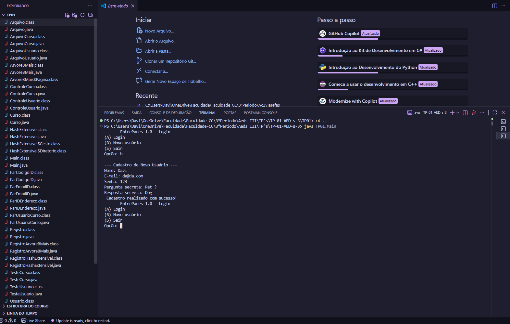
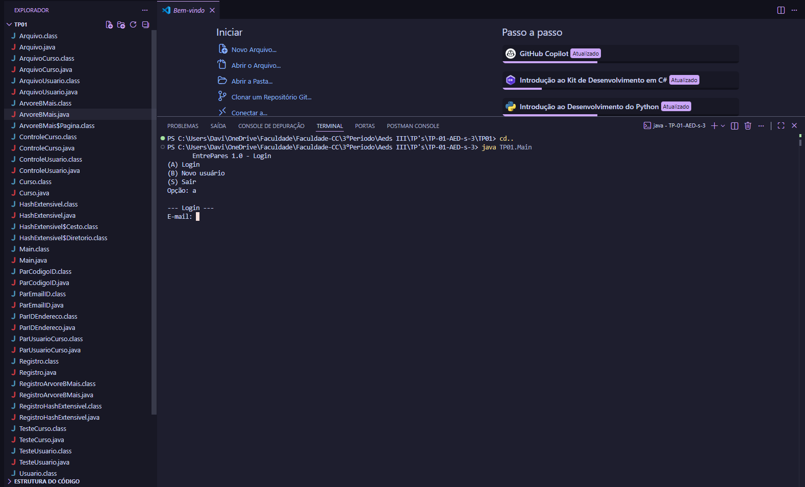
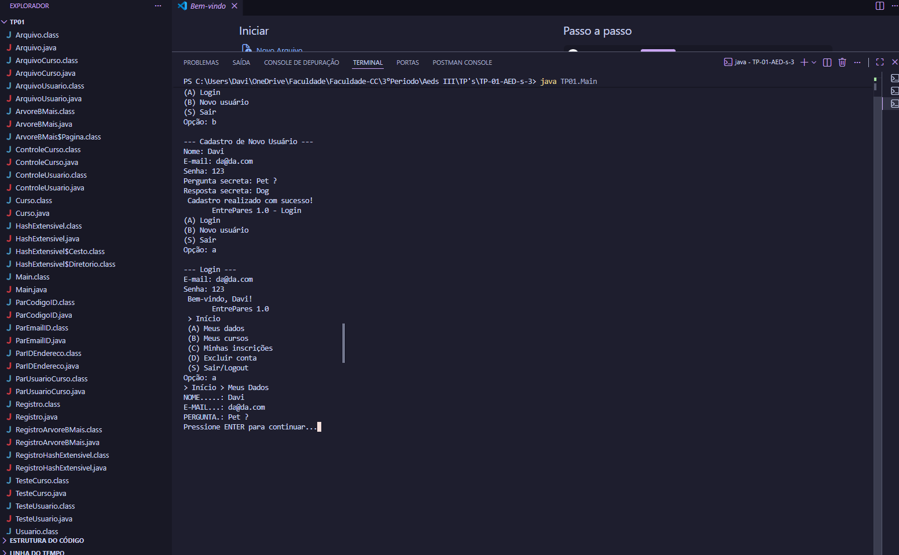

# TP-01-AED-s-3
Este, repositório serve para servir de suporte para nosso projeto 1 de Aeds 3 com o professor Marcos Kutova

# Relatório TP01 - Algoritmos e Estruturas de Dados III

Link do Video Da Plataforma no Youtube: [TP01-AEDS 3](https://youtu.be/K8iDMP5FKEc) 

## Participantes:
* **Davi Rafael de Oliveira Gurgel Martins**
* **Pedro Augusto Gomes de Araújo**

---

# 1. Descrição do Sistema
O Trabalho é uma plataforma de gestão de cursos livres onde alunos da PUC Minas podem atuar tanto como instrutores quanto como alunos. Nesta primeira etapa (TP1), o sistema foca no gerenciamento de Usuários (com autenticação segura) e Cursos (vinculados a um proprietário). O acesso é restrito a usuários cadastrados, utilizando e-mail e senha, e a persistência dos dados é feita em arquivos binários com indexação avançada para garantir performance.

---

# 2. Estrutura de Dados e Persistência
O sistema utiliza as estruturas de dados solicitadas para garantir a eficiência das buscas:
* **Tabela Hash Extensível:** Utilizada para a indexação direta do e-mail do usuário, permitindo o login rápido sem percorrer todo o arquivo.
* **Árvore B+ (Relacionamento):** Implementada para gerenciar o relacionamento 1:N, vinculando o ID de um usuário aos IDs de seus respectivos cursos.
* **Árvore B+ (Ordenação):** Utilizada como índice indireto para organizar os cursos por nome, permitindo a exibição alfabética no menu "Meus Cursos".

---

# 3. Implementação das Classes 
Para manter a organização do código, seguimos o padrão de camadas:
* **Visão (View):** As classes `VisaoUsuario.java` e `VisaoCurso.java` tratam exclusivamente da interação com o usuário (entrada e saída via terminal).
* **Controle (Controller):** A lógica de negócios, como a gestão dos estados do curso e a validação de exclusão, reside nas classes `ControleUsuario.java` e `ControleCurso.java`.
* **Modelo (Model):** As classes de entidade estendem a interface necessária para o CRUD genérico, utilizando o método `toByteArray()` e `fromByteArray()` para conversão de dados.

---

# 4. Operações Especiais
* **Segurança:** A senha do usuário não é armazenada em texto plano. Utilizamos o método `hashCode()` da classe String para armazenar apenas o código verificador.
* **Identificadores:** Os cursos utilizam o NanoID de 10 caracteres para compartilhamento externo, gerado pela função `gerarCodigo()`.
* **Integridade:** Implementamos a trava de segurança que impede a exclusão de um usuário que possua cursos ativos no sistema.

---

# 5. Checklist de Requisitos
* **Há um CRUD de usuários (que estende a classe ArquivoIndexado, acrescentando Tabelas Hash Extensíveis e Árvores B+ como índices diretos e indiretos conforme necessidade) que funciona corretamente?** Sim, o CRUD de usuários está funcional e integrado aos índices de Hash e Árvore B+.
* **Há um CRUD de cursos (que estende a classe ArquivoIndexado, acrescentando Tabelas Hash Extensíveis e Árvores B+ como índices diretos e indiretos conforme necessidade) que funciona corretamente?** Sim, o CRUD de cursos utiliza os índices necessários para busca e ordenação.
* **Os cursos estão vinculados aos usuários usando o idUsuario como chave estrangeira?** Sim, a entidade curso armazena o ID do usuário como referência de propriedade.
* **Há uma árvore B+ que registre o relacionamento 1:N entre usuários e cursos?** Sim, utilizamos a estrutura de Árvore B+ para ligar um usuário a múltiplos cursos.
* **Há um CRUD de usuários (que estende a classe ArquivoIndexado, acrescentando Tabelas Hash Extensíveis e Árvores B+ como índices diretos e indiretos conforme necessidade)?** Sim, a implementação segue rigorosamente a herança da classe genérica de arquivos.
* **O trabalho compila corretamente?** Sim, o projeto foi compilado sem erros.
* **O trabalho está completo e funcionando sem erros de execução?** Sim, todas as rotinas de navegação, cadastro, edição e troca de estados foram testadas.
* **O trabalho é original e não a cópia de um trabalho de outro grupo?** Sim, todo o desenvolvimento lógico e a implementação da interface foram realizados pelo grupo.

---

# 6. Capturas de Tela

### Tela de Cadastro

### Tela de Login

### Tela de Dados

### Tela de Curso

---

